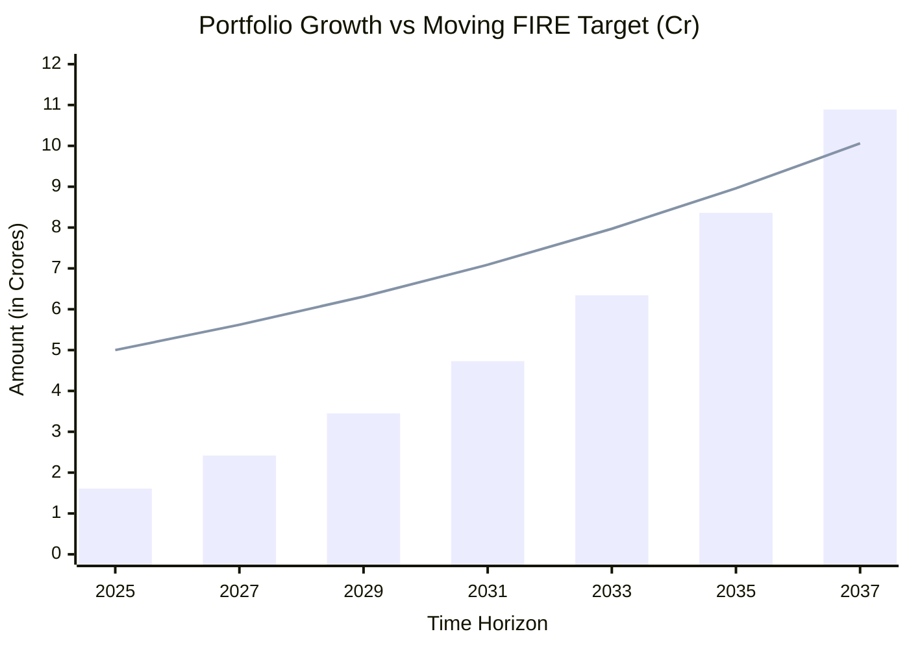

# FIRE Plan (Financial Independence, Retire Early)

## 🎯 Primary Goal
- **FIRE Number:** ₹5,00,00,000 (5 Cr) as of today's date (2025)

## 🧮 FIRE Strategy: The 3% Rule
While the 4% rule is popular globally, applying a **3% Safe Withdrawal Rate (SWR)** is a much safer bet for India due to higher inflation and currency depreciation risks.

**Validation on your withdrawal math:**
*Note: Your calculation of ₹333/month per ₹1L saved was actually based on the 4% rule. Here is the breakdown:*
- **4% Rule:** ₹1,00,000 saved = ₹4,000/year = **₹333/month** before tax
- **3% Rule:** ₹1,00,000 saved = ₹3,000/year = **₹250/month** before tax
*(To comfortably withdraw ₹333/month under the stricter 3% rule, you would actually need to accumulate ~₹1,33,333).*

## 📈 Compounding & Savings Insights
- **Monthly Savings Target:** ₹1.6 Lakhs (₹1,60,000)
- **Yearly Savings Target:** ₹19.2 Lakhs
- **Current Liquid Corpus:** ~₹1.61 Cr (US Stocks @ 92.24 INR + PF)
- **Assumed Average Annual Return:** 12%
- **Assumed Annual Inflation (for FIRE adjustment):** 6%

### Hitting Your FIRE Goal
As your portfolio compounds and you add your monthly savings, your FIRE target also increases each year due to inflation. Based on the assumptions above, here is a detailed year-by-year tracked calculation to see exactly when your portfolio will eclipse your ever-moving FIRE number:

| Year | Portfolio Value (Start of Year + Returns + ₹19.2L Savings) | Moving FIRE Target (Adjusted for 6% Inflation) | Gap to FIRE |
|---|---|---|---|
| **2025 (Today)** | **₹1.61 Cr** | **₹5.00 Cr** | -₹3.39 Cr |
| 2026 | ₹1.99 Cr | ₹5.30 Cr | -₹3.31 Cr |
| 2027 | ₹2.42 Cr | ₹5.62 Cr | -₹3.20 Cr |
| 2028 | ₹2.91 Cr | ₹5.96 Cr | -₹3.05 Cr |
| 2029 | ₹3.45 Cr | ₹6.31 Cr | -₹2.86 Cr |
| 2030 | ₹4.06 Cr | ₹6.69 Cr | -₹2.63 Cr |
| 2031 | ₹4.73 Cr | ₹7.09 Cr | -₹2.36 Cr |
| 2032 | ₹5.49 Cr | ₹7.52 Cr | -₹2.03 Cr |
| 2033 | ₹6.34 Cr | ₹7.97 Cr | -₹1.63 Cr |
| 2034 | ₹7.29 Cr | ₹8.45 Cr | -₹1.16 Cr |
| 2035 | ₹8.36 Cr | ₹8.96 Cr | -₹0.60 Cr |
| **2036 (FIRE Hit!)**| **₹9.55 Cr** | **₹9.49 Cr** | **+₹0.06 Cr** |
| 2037 | ₹10.89 Cr | ₹10.06 Cr | +₹0.83 Cr |

*(The blue bars represent your projected portfolio compounding at 12% + ₹19.2L added annually. The line represents your ₹5 Cr FIRE target swelling at 6% inflation. They intersect in ~2036).*

### 🛑 Hypothetical Scenario: "If I Retired Today"
Let's assume you retire *right now* and immediately isolate/carve out specific chunks of capital from your current corpus to pre-fund the education and marriage events of your daughters over the next 24 years. These "carved out" chunks will compound silently in the background at 12%, perfectly paying for the inflated events when they arrive. How much liquid capital is left over for your monthly expenses today using the 3% rule?

**Present Value Needed Today (compounding @ 12% to meet future inflated costs):**
- **Elder Daughter Edu PV:** ₹12.75 Lakhs *('seeds' the ₹35.4L future cost)*
- **Elder Daughter Marriage PV:** ₹8.38 Lakhs *('seeds' the ₹51.4L future cost)*
- **Younger Daughter Edu PV:** ₹11.04 Lakhs *('seeds' the ₹75.8L future cost)*
- **Younger Daughter Marriage PV:** ₹6.27 Lakhs *('seeds' the ₹95.1L future cost)*
> **Total Capital to "Carve Out" Today:** ₹38.45 Lakhs

| Metric | Amount |
|---|---|
| Current Liquid Base (US Equities + PF) | ₹1.61 Cr |
| Plus: Sukanya Samriddhi (SSY) Balance | +₹0.06 Cr (₹6L) |
| **Total Global Liquid Assets Today** | **₹1.67 Cr** |
| *Less: Immediate "Carve Out" for Daughters* | *-₹0.38 Cr (₹38.45L)* |
| **Net Retiring Corpus (Left to live on)** | **₹1.28 Cr** |
| **3% Safe Withdrawal Rate (Yearly Gross)** | **₹3.86 Lakhs/year** |
| **Gross Monthly Draw** | **₹32,138/month** |

### 💳 The Reality Check: Subtracting Fixed Overhead Today
If you are withdrawing ₹32,138/month (₹3.86 Lakhs/year), we must first subtract your mandatory, recurring fixed expenses from this pool *before* you can spend a single rupee on groceries, rent, or lifestyle.

**Your Recurring Non-Negotiable Overhead:**
- **Parents' Medical Insurance:** ₹40,000/year
- **Self Term Insurance:** ₹17,000/year
- **Family Medical Insurance (Self/Wife/Kids):** ~₹20,000/year (Pending)
- **Elder Daughter's School Fees:** ₹60,000/year
- **Younger Daughter's School Fees:** ~₹60,000/year (Assuming same current fee structure when she starts)
- **Bike Insurance:** ₹2,000/year
- **Internet Bill:** ₹8,400/year (₹700/month)
- **Haircut:** ₹1,200/year (₹150 every 1.5 months = 8 cuts/year)
> **Total Fixed Yearly Overhead:** ₹2,08,600/year (~₹2.08 Lakhs)

| Metric | Amount |
|---|---|
| SWR (Yearly Gross) | ₹3.86 Lakhs |
| *Less: Total Fixed Overhead (Insurances + Schooling + Utilities)* | *-₹2.08 Lakhs* |
| **True Disposable SWR (Yearly)** | **₹1.78 Lakhs/year** |
| **True Disposable SWR (Monthly)** | **₹14,833/month** |

*Conclusion: In the hypothetical scenario where you retire today, fully pre-funding all 4 major life events for your daughters, and paying all insurance, utilities, and dual schooling overhead off the top... you would be left with a net disposable income of **₹14,833 per month** for all your family's unmapped daily living expenses (groceries, travel, petrol, medical out-of-pocket, electricity, etc).*

## 💰 Current Assets
- **MSFT RSUs + ESPP:** ~$108,000 (~₹99.6L at 92.24 INR/USD)
  - *See [msft.md](./msft.md) for detailed tax-exit & diversification strategy*
- **Other US Equities:** ~$28,537 (~₹26.3L) *(SOXX, NFLX, META, AMZN, ADBE, ORCL, QQQ, SONY)*
  - *References: [US Market Strategy](../../kite/users/srikanth/reports/us_market_strategy.md) | [Fundamentals Scorecard](../../kite/users/srikanth/reports/fundamentals_scorecard.md)*
- **Total US Equity Portfolio:** ~$136,537 (~₹1.25 Cr at 92.24 INR/USD)
- **Provident Fund (PF):** ₹35,00,000 (35L)
- **Sukanya Samriddhi (SSY):** ₹6,00,000 (6L — for daughters)
- **Total Liquid Retirement Corpus:** ~₹1.67 Cr

*Other illiquid/dependant assets:*
- **Father's House:** ₹25,00,000 - ₹30,00,000 (25L - 30L)
  - *Note: Pending home loan of ₹10,00,000 (10L) to be paid off.*
- **Father's Fixed Deposits (FD):** ~₹15,00,000 (15L)
- **Jewelry:** Value yet to be estimated.

## 🛡️ Insurance Portfolio
- **Life Insurance:** ₹1,00,00,000 (1 Cr) Term Insurance for self.
- **Medical Insurance:** 
  - ✅ **Active:** Covered for parents.
  - ❌ **Pending:** Need to acquire a medical insurance policy for self, wife, and 2 daughters (9yo and 1.5yo).

## 💸 Future Expenditures & Liabilities (Milestone Goals)
- **Debt Payoff:** ₹10,00,000 (10L) home loan remaining for father's house.
- **Children's Education (Assuming ₹15L present cost per child @ 10% annual education inflation):**
  - **Schooling:** Elder daughter (9yo) fees are roughly ₹60,000/year. Upcoming fees for younger daughter (1.5yo).
  - **Elder Daughter (9yo) Higher Ed:** Target Age 18 (in 9 years, ~2035). 
    - Future Cost: `₹15L * (1.10)^9` ≈ **₹35.4 Lakhs**
  - **Younger Daughter (1.5yo) Higher Ed:** Target Age 18 (in ~17 years, ~2043).
    - Future Cost: `₹15L * (1.10)^17` ≈ **₹75.8 Lakhs**
- **Marriage (Assuming ₹15L present cost per child @ 8% annual inflation):**
  - **Elder Daughter (9yo) Marriage:** Target Age 25 (in 16 years, ~2042). 
    - Future Cost: `₹15L * (1.08)^16` ≈ **₹51.4 Lakhs**
  - **Younger Daughter (1.5yo) Marriage:** Target Age 25 (in ~24 years, ~2050).
    - Future Cost: `₹15L * (1.08)^24` ≈ **₹95.1 Lakhs**

> **Total Extra Burden for Milestones:** Over the next 24 years, you will need to map out separate capital or sink funds totaling roughly **~₹2.57 Crores** specifically for these events. Because these hits happen over decades, they represent cash-flow events you can either pre-fund now via systematic SIPs or pay down structurally from your compounding FIRE corpus later without destroying the 3% withdrawal principle.
