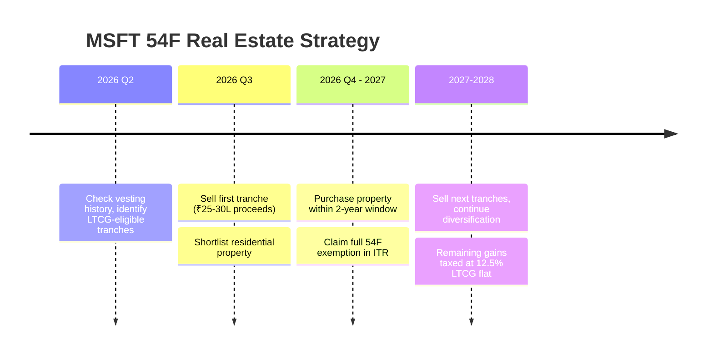
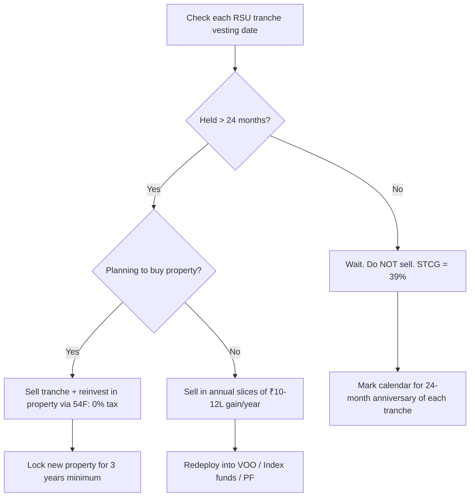

# 💼 MSFT RSU Strategy: Tax-Optimal Exit & Diversification Plan

> Last updated: March 11, 2026 | USD/INR: 92.24 | ~$108K MSFT position (RSUs + ESPP)

---

## 📊 Your MSFT Situation
- **Current MSFT Position:** ~$108,000 (₹99.6 Lakhs approx at 92.24 INR/USD)
- **All-Time High touched:** $555/share
- **Nature of Holdings:** Employer RSUs + ESPP (15% voluntary contribution @ 10% discount)
- **Monthly ESPP Contribution:** ₹41,250/month (15% of ₹2.75L payslip)
- **Income Situation:** Already breaching ₹50 Lakhs annual income slab, attracting surcharge + cess

> ⚠️ **The Core Risk (from US strategy):** Your MSFT is the **epicenter of the AI circular funding bubble**. If OpenAI/Copilot revenues don't justify Azure's AI capex, MSFT valuation re-rates sharply downward. This makes this a **concentration + bubble risk** double problem, not just a tax problem.

---

## 💳 ESPP Analysis: Should You Continue the 15% Voluntary Contribution?

**Your Setup:**
- Monthly salary (payslip): ₹2,75,000
- ESPP deduction (15%): ₹41,250/month → **₹4,95,000/year contributed**
- Discount: **10%** — you receive shares worth ₹45,833 for each ₹41,250 invested
- Net monthly cash-in-hand impact: Salary drops from ₹2.75L → ~₹2.34L

### The Math: Sell Immediately vs. Hold

| Strategy | Gross Gain | Tax | Net Gain | Annual Profit |
|---|---|---|---|---|
| **Sell same day (STCG, ~39% slab)** | 10% = ₹4,950/cycle | ~₹1,930 tax on gain | **~₹3,020/cycle** | ~**₹24,160/year** |
| **Hold 24mo → sell (LTCG, ~14.95%)** | 10% = ₹4,950/cycle | ~₹740 tax on gain | **~₹4,210/cycle** | ~**₹33,680/year** — but adds MSFT exposure |
| **Don't participate at all** | ₹0 | ₹0 | **₹0** | — |

> 💡 Even selling immediately (worst-case tax), you pocket roughly **₹24,000+ in near-guaranteed annual profit** just from the discount arbitrage. This beats comparable fixed-income returns on ₹4.95L invested (FDs at 6.5% pre-tax = ~₹32K, but taxed at slab = ~₹19.5K net). **ESPP even at STCG is better than doing nothing.**

### 🎯 Verdict: **Continue ESPP, but sell every purchase cycle immediately**

1. ✅ **Continue the 15% ESPP contribution** — the 10% discount is essentially free, guaranteed alpha.
2. ✅ **Sell all ESPP shares on or shortly after each purchase cycle ends** (typically every 6 months).
   - This avoids adding to your MSFT concentration while still pocketing the discount.
   - Treat ESPP as a "cash bonus mechanism" — not a buy-and-hold investment.
3. ❌ **Do NOT hold ESPP shares for 24 months** just to get LTCG treatment. The ~4% tax savings (~₹9.5K/year) does NOT justify the additional MSFT concentration risk and the opportunity cost of capital being locked in a single volatile stock.
4. ✅ **Redeploy ESPP sale proceeds** into your diversified portfolio (VOO, Nifty 50 index fund, or SSY top-up for daughters).

---

## 🧾 Tax Framework (India — FY 2025-26)

Understanding the Indian tax treatment of your MSFT RSUs is step one.

### At RSU Vesting
- **Category:** Perquisite ("Salary Income")
- **Tax Rate:** Your income slab rate (30%) + 25% surcharge (since income >50L) + 4% cess
- **Effective Rate:** ~34.32%
- **Who deducts:** Your employer (TDS deducted on vesting)
- **Cost Basis (for future sale):** FMV on vesting date — not your original grant price

### On Sale of Vested Shares (Capital Gains)
| Holding Period | Gain Type | Tax Rate | Surcharge | Cess | **Effective Rate** |
|---|---|---|---|---|---|
| **< 24 months from vesting** | Short-Term (STCG) | Per slab (30%) | 25% (>50L income) | 4% | **~39.00%** |
| **> 24 months from vesting** | Long-Term (LTCG) | **12.5% (flat)** | Capped at 15% | 4% | **~14.95%** |

> 💡 **Key Insight:** LTCG on US stocks is taxed at just **12.5% (effective ~14.95%)** — dramatically lower than STCG which piggybacks onto your income slab and could touch ~39%. This **24-month holding rule is the single biggest lever you have.** 
> 
> Since RSUs vest in tranches, each tranche has its own 24-month clock starting from its respective vesting date.

### No Indexation Benefit
Unlike Indian property sales, US stock LTCG does NOT get indexation (inflation adjustment) benefit. The gain is calculated on the raw FMV at vesting.

---

## 📅 Phased Exit Plan: The Right Way to Sell

### Rule #1: Never Sell Short-Term
If a RSU tranche vested less than 24 months ago, **do NOT sell it yet.** The slab-rate STCG (~39%) will devastate returns vs waiting for LTCG threshold (~14.95%). 

**The math:** On ₹15L of gain, the difference is:
- STCG: ~₹5.85L in tax  
- LTCG: ~₹2.24L in tax  
- **Savings by waiting = ₹3.6L per ₹15L gain**

### Rule #2: Tranched Annual Sales (Tax-Year Slice)
Instead of selling all RSUs at once (catastrophic tax event), **spread the sale over 3-5 financial years** in a disciplined, calendar-based approach:

| Year | Action | Rationale |
|---|---|---|
| **FY 2026 (Now)** | Identify all RSU tranches that crossed the 24-month mark. Sell a slice that generates **≤ ₹10-12L in LTCG.** | Keeps total income from hitting a punishing surcharge cliff |
| **FY 2027** | Sell the next tranche window (those that turn 24mo during this year). Target same ₹10-12L gain range | Spread the tax liability over multiple ITR filings |
| **FY 2028** | Continue the systematic liquidation | By now, you should be winding down concentration |
| **FY 2029** | Final or near-final tranche. | At this point, MSFT should represent <15% of net worth |
| **Post-Retirement** | Any residual MSFT you hold past retirement — sell in a year when your total income is below ₹50L (no surcharge!) | This drops effective rate from 14.95% → ~13.00% |

> 🎯 **Key Insight on Post-Retirement Timing:** If you retire and your income drops below ₹50L, the 25% surcharge on LTCG disappears. Your effective LTCG rate drops from ~14.95% to ~13.00%. **This is a legitimate tax optimization reason to hold a thin tranche until retirement.**

---

## 🏦 Should You Diversify Now or After Retirement?

### Verdict: **Diversify NOW, with discipline.**

| Factor | Now (Working) | After Retirement |
|---|---|---|
| **Bubble Risk** | 🔴 High — AI narrative is fragile | 🟡 Could correct anytime |
| **MSFT % of Net Worth** | 🔴 Dangerously high concentration | Would be legacy exposure |
| **Tax Rate if LTCG** | ~14.95% | ~13.00% (lower — no surcharge) |
| **Deployment Opportunity** | 🟢 Immediate — can reinvest gains into VOO/India positions | 🟡 Decent but lower earning years |
| **Time in Market After Sell** | 🟢 Longer runway for new positions to compound | ❌ Less compounding window |
| **Behavioral Risk** | Discipline needed | Regret risk if MSFT crashes before you sell |

**Recommendation:** Start selling in **equal-sized quarterly tranches** of your LTCG-eligible shares starting immediately. The marginal LTCG tax difference (~2%) between now and retirement is NOT worth the concentration + bubble risk of waiting. You lose more to a 30% MSFT correction than you save in a 2% tax rate difference.

---

## 🔮 The Analyst Trap: Should You Wait for $576-$670?

Currently (March 2026), MSFT is trading around **$405**. It hurts to sell here when some Wall Street analysts are projecting PTs (Price Targets) of **$576 to $670** by the end of 2026 or 2027. You might feel that "selling now means giving up profit after waiting so long." 

However, holding a concentrated $108K position based on analyst targets is a classic behavioral finance trap. Here is why you must divest logically rather than hope for $670:

### 1. The "Sunk Cost & Anchoring" Fallacy
You are anchoring your internal valuation to the all-time high of **$555**. Because it touched $555 before, your brain feels that selling at $405 is "taking a loss" against what you *could* have had. In reality, $405 is the true market value today. If you had $108,000 in cash in your bank account right now, **would you buy MSFT at $405 today?** If the answer is no, you shouldn't be holding it either.

### 2. Analysts Are Lagging Indicators
Wall Street analysts rarely predict crashes; they extrapolate current trends. During the dot-com bubble (2000), CSCO (Cisco) had analyst targets predicting it would be the first trillion-dollar company. It crashed 80% and took *20 years* to recover. Analysts predicting $670 are assuming perfectly linear growth in AI cloud revenue without pricing in the very real "circular funding" risk outlined in your US Strategy dock.

### 3. Concentration Risk > Upside Potential
If MSFT goes to $600, you make an extra $50,000. If the AI capex bubble bursts and MSFT reverts to its historical mean PE ratio, it could easily drop to $250, wiping out **$40,000+** of your real net worth. As someone mapping out a FIRE strategy with concrete milestone goals for your daughters, **preservation of capital is more critical than maximizing a single stock's upside.** 

### The Solution: The 50% Rule
You don't have to sell everything. If you strongly believe the analysts might be right, **sell 50% over the next 12-18 months and let the remaining 50% ride.**
- **If it crashes:** You secured half your wealth and diversified it into the resilient S&P 500 (VOO).
- **If it goes to $670:** The house money you left on the table captures the upside.

---

## 🏠 Real Estate: Can It Offset Your MSFT Gains?

**Yes — and this is one of the most powerful legal tax shields available to you.** The tool is **Section 54F of the Income Tax Act.**

### What is Section 54F?
Section 54F allows you to **claim full LTCG exemption** on sale of any long-term capital asset (incl. US stocks) **if you reinvest the entire net sale proceeds into a new residential property in India** within the specified window.

### Section 54F Rules
| Rule | Detail |
|---|---|
| **Eligible Asset Sold** | Long-term US stocks (held > 24 months from vesting) ✅ |
| **Reinvestment Target** | Purchase OR construct ONE residential house property in India |
| **Purchase Window** | 1 year before OR 2 years after the stock sale date |
| **Construction Window** | 3 years from stock sale date |
| **Cap** | Max exemption capped at ₹10 Crore (from FY 2023-24) |
| **Ownership Condition** | You must NOT own more than 1 house at time of stock sale |
| **Lock-in** | New house must not be sold within 3 years of purchase |

### How Much Can You Save?
Assuming you sell ₹90L worth of LTCG-eligible MSFT RSUs:

| Scenario | Taxable Gain | Tax (@ 14.95%) | After 54F Exemption (Full) |
|---|---|---|---|
| Sell & do nothing | ₹90L | **₹13.45L tax** | N/A |
| Sell + Reinvest in home | ₹90L | **₹0 tax** | **₹13.45L saved** |
| Sell + Partial Home (50%) | ₹90L | **₹6.7L tax** | ₹6.75L saved |

### How Much Real Estate Should You Buy?
For **complete exemption**, you must reinvest **the entire sale proceeds** (not just the gain portion) into the property.

- **Your MSFT is ~₹92L** — to get full 54F exemption on the full liquidation, you'd need to buy a property worth ≥ ₹92L.
- This aligns perfectly with buying a **home of your own** or **an investment property** in any Tier-1 Indian city.
- Even a budget apartment in a metro suburb (₹50-80L range) qualifies for a **proportionate partial exemption**.

### Ideal Timing for 54F Play

> ⚠️ **54F Trap to Avoid:** Your father currently owns one house. That house is in his name — it should NOT disqualify your 54F eligibility as long as you personally don't own more than 1 house at the time of your own stock sale. **Consult a CA to confirm this before filing.**

---

## 🎯 Where to Redeploy the Proceeds After Selling MSFT?

After selling and paying (or 54F-exempting) your MSFT gains, here is the priority order for reinvestment:

| Priority | Asset | Why |
|---|---|---|
| 1 | **Real estate (own home if renting)** | 54F exemption wipes the tax + housing is a need |
| 2 | **VOO / Nifty large-cap index fund** | Broad diversification, replaces single-stock risk |
| 3 | **Nifty 50 (MF or ETF)** | India-side compounding asset for FIRE corpus |
| 4 | **Daughters' SSY top-up** | Tax-free at maturity + inflation-hedged (8% govt rate) |
| 5 | **PPF top-up (self + wife)** | ₹1.5L/yr each — tax-free, debt side of portfolio |

---

## 🔢 Summary: The Optimal Game Plan

### Quick Summary Table
| Action | Now | At FIRE |
|---|---|---|
| Sell STCG tranches | ❌ | ❌ |
| Sell LTCG tranches | ✅ Annually | ✅ (lower tax) |
| Use 54F to wipe tax via property | ✅ Best now | ⚠️ Only if buying property anyway |
| Diversify into Index/VOO | ✅ Aggressively | Ongoing |
| Keep MSFT representing >25% of net worth | ❌ Never | ❌ Never |

> **Bottom Line:** Your $100K MSFT stash is a **high-risk, high-concentration fire hazard.** Sell it in tax-efficient tranches (LTCG only, ₹10-12L/year), use the 54F real estate route to turbocharge your first major exit, and systematically deploy proceeds into diversified India + global index positions. You don't need to rush everything in one year — a disciplined 3-5 year exit plan is both tax-optimal and financially smart.
